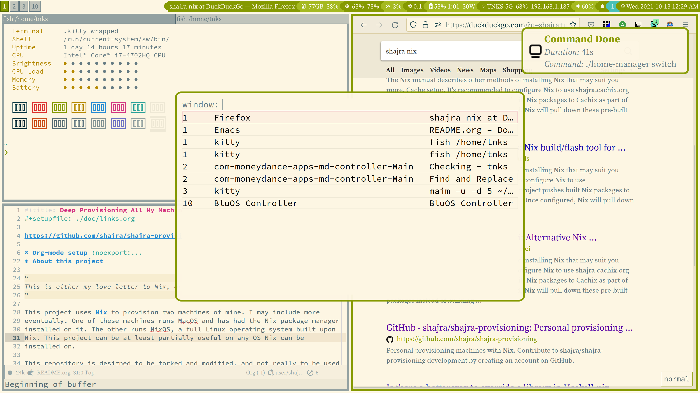

- [Computer setup with NixOS-style modules](#sec-1)
- [Some goals](#sec-2)
  - [Keybinding and flexibility](#sec-2-1)
  - [Reasonable resource consumption](#sec-2-2)
  - [Humane ergonomics](#sec-2-3)
- [The terminal experience](#sec-3)
  - [The terminal emulator](#sec-3-1)
  - [An informative shell prompt](#sec-3-2)
  - [The shell](#sec-3-3)
  - [Fish integrations](#sec-3-4)
  - [Extras](#sec-3-5)
- [Linux window management](#sec-4)
  - [The window manager](#sec-4-1)
  - [Input selector and application launcher](#sec-4-2)
  - [The notification server](#sec-4-3)
  - [The statusbar](#sec-4-4)
  - [Extras](#sec-4-5)
- [Mac configuration](#sec-5)
  - [Window management](#sec-5-1)
  - [Brew](#sec-5-2)
- [Editor](#sec-6)
- [Theming](#sec-7)
  - [Color Selection](#sec-7-1)
  - [Color and font configuration with Nix](#sec-7-2)
  - [Application of theme](#sec-7-3)
- [What sucks](#sec-8)

# Computer setup with NixOS-style modules

Configuring a computer can seem like a frivolous exercise, especially when it comes to terminal programs and Linux window management. It's almost certainly not as much of a productivity boost as some might insinuate. But there's nothing wrong with feeling good about a tailored and functional environment with some aesthetic charm.

[NixOS's `nixos-rebuild`](https://nixos.org/manual/nixos/stable/index.html#sec-changing-config), [Nix-Darwin](https://daiderd.com/nix-darwin), and [Home Manager](https://github.com/nix-community/home-manager) provide a lot of NixOS-style modules that make it easy to enable a variety of programs and services. Home manager even tells you when there's new configurations, so you can keep up with the latest available. Overall, it's easier to discover and try out new things.

Configuration needs to be treated with the same care as code in general, but it also has specific needs of its own. In particular, configuration has even more need than general code to be simple and modular. We don't want the configuration of one program to have confounding effects another. Under the assumption that general programming languages invite these entanglements, some programs limit configuration to formats like YAML or TOML. Nix-style modules work hard to retain simple configuration by convention, without witholding the full expressiveness of Nix expressions. In practice, this seems to work out well.

In instances in which plain NixOS-style module configuration still leads to excessive repetition and boilerplate, it helps to have the full expressiveness of Nix expressions, including a large supporting ecosystem of library functions in Nixpkgs to draw from.

The rest of this document highlights some of the setup this project does. The document explains my rationale for personal preferences, admittedly slipping into advocacy for things I enjoy. I've just put in more hours than I care to admit into this, and feel like sharing. And after over twenty years of setting up Linux systems, this is a way to reflect on some choices. I cover my Linux configuration more deeply than my Mac configuration, but a lot of configuration is shared by both platforms.

# Some goals

## Keybinding and flexibility

I've come to appreciate the benefit of good keybindings, and the ability to script a developer experience to my preferences. It just feels good to not feel like you're fighting the computer to get what you want (though I had to fight a computer plenty to get to this point).

Regarding keybindings, Vim-style directional keys are ingrained in my muscle memory, and I appreciate their emphasis on getting more from the home row. So in addition to using programs with good support for custom keybinding, I'm also inclined to configure as much as possible to use Vim-style directional keybindings as appropriate.

## Reasonable resource consumption

I don't buy machines too regularly. Even if I can afford the cost, I'd rather use machines for as long as I can to avoid the environmental impact of disposal. Even recycling has an environmental impact, so I appreciate when software is resource-light enough that I can keep computers for well over five years. Ideally, I'd like to keep them useful for closer to ten.

## Humane ergonomics

I can appreciate the value of a good user experience. Some of this can be purely aesthetic. But sometimes design concerns are more architectural. For instance, rendered text should be legible and minimize eye strain.

Though it's hard to tell, I actually appreciate a system that's beginner-friendly. Good design addresses both new and advanced users alike. Unfortunately, this is one area where programs targeting more advanced users fall short. UI elements are often so minimal that even if when elements can be manipulated by a mouse, it's not clear because there's no visual indication when hovering over. Similarly, each program provides a complicated array of keybindings, almost all of which can be reconfigured by users, but there's no great way to see a global view of all the keybindings available for programs in focus/context.

Ultimately, I'm the only one using my computers, so I've compromised my expectations for friendliness for other users. But I don't want to justify or defend this compromise. On face value, technology is supposed to help all of society. But in reality we don't do that great a job of thinking of much other than ourselves.

# The terminal experience

All considered, I'm happy enough with how the [Kitty terminal emulator](https://sw.kovidgoyal.net/kitty/), [Fish shell](https://fishshell.com/), and [Starship prompt](https://starship.rs/) came together in this project. There's also some other small touches to a few other things such as man pages and Git.

## The terminal emulator

I have both [Kitty](https://sw.kovidgoyal.net/kitty/) and [Alacritty](https://alacritty.org/) configured similarly, but currently use Kitty for both Linux and Mac machines.

Both Kitty and Alacritty are GPU-accelerated terminal emulators supporting true color and other modern features. At the time of this writing, Kitty has more features. It can inline images, supports tabs, and can split screens. Kitty also can open multiple terminals from one process. This is particularly nice on Macs where each process shows up in the dock separately.

Kitty is also extendable with what the project calls “kittens.” Kittens rely on Python, which seems a bit heavy of a dependency for a terminal emulator. But these days Python has likely already been pulled in by another tool already, and any performance cost of Kitty's scripting with Python is imperceptible.

Though Kitty has more features, it also delegates more to external tools for these features. For example, Alacritty has a builtin Vi mode for navigating history in the scrollback. This is provided by default, and works out of the box. Kitty instead delegates to an external scrollback pager. This is more flexible, and you can use an actual instance of Vim/Neovim for more than the limited Vi functionality baked into Alacritty's Vi mode. However, it took a while to figure out how to configure Vim/Neovim to work well as a pager with Kitty. Once configured, it seems to work fine, but this seems to be a reoccurring theme when comparing Alacritty with Kitty. Alacritty tends to build features in directly, and as a result may have less features. But these features tend to work as expected with default settings. Kitty has more features, but can require more configuration to get things working well because of complications with external dependencies. This extra configuration doesn't amount to many more lines of code, but may take time to figure out if starting from scratch.

Because of the features I actually use, I could likely replace my usage of Kitty with Alacritty on Linux and not notice the difference. On Macs, though, I do like keeping the dock cleaner by serving multiple terminals from a single Kitty process.

## An informative shell prompt

I'm currently using [Starship](https://starship.rs/) to get an informative prompt for my shell.

At first this can seem like a vanity, but especially for new programmers using Git, it's important to get an accurate view of the state Git is in. Without a good view of Git's state, it's too easy to get lost or make mistakes (for instance, when resolving conflicts). A good shell prompt helps a lot.

Asking new programmers to install an advanced shell prompt previously felt tedious, and a distraction from the task of programming. But if Nix is already installed and available, it's nice that Home Manager makes the installation and configuration of Starship so simple.

Additionally, Starship is considerably fast, with more features than anything else similar I've ever used. Most importantly, if a calculation is taking long, Starship automatically times out and gives a simpler prompt, rather than delay access to the terminal.

## The shell

I'm currently using [Fish](https://fishshell.com/) as my shell.

Before I discovered Nix and Home Manager, I started out using Bash as a shell because it was the default shell on so many systems. I had my hand-crafted `.bashrc` file, and wanted the convenience of just copying it around. Eventually I begrudgingly moved to [Zsh](https://www.zsh.org/) because I liked its support for so many command line completions. Also, projects like [Oh-my-zsh](https://ohmyz.sh/) had useful prompts. Once on Zsh, I again didn't want to change shells because I still had dotfiles that I was carrying from system to system (`.zshrc`, `.zshenv`, and so forth). Also, I liked that Zsh (and Bash before it) were so similar to POSIX shell, which is a compact language that I've known well.

Despite apprehensions of moving from Zsh to Fish, Home Manager made it easier to try out. The Home Manager configuration options for Fish are more digestible and simple than all the files under `~/.config/fish`, which Home Manager creates on my behalf.

Fish deviates farther from POSIX shell, but it does so sensibly. It's generally a familiar syntax. More importantly, it's a smaller language with less finicky corner cases than both Zsh and Bash, which carry too much legacy from POSIX shell. The movement away from POSIX shell seems to have a good payoff. Also, the online documentation for Fish is also notably good, which I found nicer than resources available for both Bash and Zsh.

Fish doesn't always have the same completions that might be available for Zsh, but it more than makes up for that with its exceptional support for autosuggesting commands based on what you're currently typing, your command history, and your current directory. Autosuggestions are a default Fish feature, and you just use the left arrow key to accept the suggestion. For this feature alone, I don't see any motivation for moving back to Zsh or Bash. For each directory, it's just too common to type the same command, making the autosuggestions too often useful.

## Fish integrations

Fish comes with useful keybindings and features out of the box. Some extensions this project adds are integration with

-   [FZF](https://github.com/junegunn/fzf), a fuzzy search selection interface
-   [Zoxide](https://github.com/ajeetdsouza/zoxide), an autojumper
-   [Clipmenu](https://github.com/cdown/clipmenu), a clipboard manager
-   [Direnv](https://direnv.net/), an environment variable manager.

FZF at its core is a way to select from a list. You pipe options to it, and then it presents an interface to select one using fuzzy substring matching. FZF comes with some applications of this builtin, for instance file selection. But you can script FZF to select from any kind of inputs.

Zoxide keeps statistics of how often directories have been changed to, which can then be queried relative to a substring to jump to a commonly accessed directory without typing the whole path out.

Clipmenu is a nice way of accessing a history of previously copied selections for pasting.

Direnv hooks into various shells to automatically change environment variables upon entering a directory. This can be really useful for project-specific tooling when programming.

Here's some keybindings enabled by this integration:

-   `Alt+j` selects with FZF a directory within the current directory, and jumps to it.
-   `Alt+f` selects with FZF a file within the current directory and puts the path in the command line.
-   `Alt+c` selects with FZF a clipboard item from Clipmenu.

I also have the following aliases:

-   `ji SUBSTRING` selects with FZF a directory from a list provided by Zoxide, and jumps to it (`ji` is short for “jump interactive”).
-   `j SUBSTRING` jumps to a commonly used directory (determined by Zoxide) if one directory seems obvious, otherwise presents FZF same as `ji`. I tend to just use `j` over `ji`.

Direnv comes with some default Fish hooks, but these can't be enabled and disabled explicitly. This means that if the calculation of environment variables takes some time, you have to wait, just to change into a directory. That's especially inconvenient if you want to access the directory, but don't care about the environment variables. So I don't use Direnv's builtin Fish hooks, and instead have the following functions in Fish:

-   `direnv-enable` to explicitly enable Direnv in a terminal
-   `direnv-disable` to explcitly disable Direnv in a terminal
-   `direnv-debug-toggle` to toggle verbosity on/off.

## Extras

I integrated [a third-party Fish plugin to colorize man pages](https://github.com/PatrickF1/colored_man_pages.fish). It's a small touch, but looks good.

I also call [Macchina](https://lib.rs/crates/macchina) for a colorful welcome message with system information in terminals. It's more for fun than utility.

Git's source code diffs have been enhanced with [Delta](https://github.com/dandavison/delta), which does syntax highlighting and other beautification.

Direnv has been extended with support for Nix with [Lorelei](https://github.com/shajra/direnv-nix-lorelei).

# Linux window management

I'm also happy with how the [I3 window manager](https://i3wm.org/), status bar based on [I3status-rust](https://github.com/greshake/i3status-rust), the [Rofi menu/launcher](https://github.com/davatorium/rofi), and [Dunst notification server](https://dunst-project.org/) came together.

The programs are all

-   modern enough with good features
-   relatively lightweight, not consuming resources needlessly
-   easy to configure (as the world of tiling window managers go)
-   possible to theme so they can integrate cohesively with one another.

## The window manager

I'm using the [“gaps” fork of I3](https://github.com/Airblader/i3). This fork only introduces a few extensions, and is largely the same as I3. I just think a small gap between windows makes their borders pop nicely, especially with a light color theme.

I3 is a tabbed+tiling window manager with a manual layout engine. I was convinced of the value of both tiling and tabbing with window managers from using [Tuomo Valkonen's Ion3](https://tuomov.iki.fi/software/ion/). Tuomo killed the Ion3 project in 2009. Though I3 is not really related to Ion3 (it's more a successor to [WMII](https://github.com/0intro/wmii)), its design is extremely similar.

The benefits of tiling aren't often debated. Most people can appreciate the value of non-overlapping windows that are easy to move around. To understand the value of tabbing, it helps to see it as minimization, but additionally spatially organized. This spacial organization for me makes tabbing strictly better than minimization alone.

Both I3 and Ion3 have a manual layout engine. This means that users manage vertical and horizontal splits manually. An alternative is a dynamic layout engine, in which there are canned layouts you can cycle among. My preference for manual layouts is subtle. I find canned layouts often lead to windows that are too small, because the windows are sized poorly relative to their content. I'd rather just control everything explicitly. If the keystrokes to manipulate a layout manually are fiddly, I've gotten used to them. And furthermore, these keystrokes can be configured to be similar to how frames are managed in editors like Emacs and Vim, so it's only foreign to a degree.

One important difference between Ion3 and I3 was Ion3's scripting with Lua. Embedding a scripting language in a window manager is both powerful, but also complicated. I3 instead provides an `i3-msg` command-line tool that can do some IPC with the window manager. With this tool, you can script I3 with the language of your choice. This seems like a nice approach to have some flexibility, without overburdening the complexity of I3's implementation.

## Input selector and application launcher

I'm using [Rofi](https://github.com/davatorium/rofi) for gathering inputs from users and also launching applications.

Rofi is very similar in functionality to [FZF](https://github.com/junegunn/fzf), but a graphical interface rather than a terminal program. It helps a user select from a list of inputs that can come from a script. Rofi comes with builtin applications such as a window switcher and a program launcher, so you don't need a script to provide inputs if these are sufficient.

Beyond the applications Rofi comes with standard, I have a keybinding `Super+w` to use it to rename the current I3 workspace. If the name is the same as another workspace, the two workspaces are swapped. In this case, Rofi isn't selecting from a list of inputs, but just reading in text from the user.

An alternative to Rofi is [Dmenu](https://tools.suckless.org/dmenu/). Dmenu is nice, but Rofi has much richer configuration of it's look-and-feel, which I value because I can get it to look very similar to Dunst. Rofi has just over 4000 lines of C rather than Dmenu's under 400, but I just can't care. Rofi looks markedly nicer, and it doesn't even run long enough to worry about resource consumption, and I have no reason to believe it consumes much resources anyway.

## The notification server

I'm using [Dunst](https://dunst-project.org/) for my notification server.

Notification servers can seem like a nuisance when programs are pushing distracting messages that aren't relevant to your current interests. Dunst helps with its degree of customization and flexibility. For instance, I have an alias in Fish of `t COMMAND ARGUMENTS...` which will time a command and then send a notification to Dunst reporting the success/failure of the command and how long it took. It even makes a sound. Notifications are great when they are exactly the ones we asked for. Sometimes things like compilation steps take a while, and it's nice to leave them in the background and move on to something else, knowing we'll be notified upon completion.

I've also configured I3 with the following keybindings:

-   `Super+n` closes last notification
-   `Super+Shift+n` reopens last closed notification
-   `Super+Ctrl+n` performs an action associated with notifications
-   `Super+Alt+n` pause/unpause notifications

It's nice to be able to close a notification with a simple keybinding, rather than having to mess with the mouse. Also, because Dunst retains the last few notifications, you can revisit dismissed notifications easily. For instance, if you have a music station sending notifications Dunst of songs as they play, these messages can be set as transient, so they automatically close after a short time. But if you want, you can easily revisit the playlist by bringing back old notifications. When you're finished, you can close them all again.

Another nice usage of transient notifications implemented by this project is to show a on-screen display (OSD) of changes to volume and screen brightness. And Dunst can be configured to exclude these messages from its retained history, since these messages aren't worth revisiting.

## The statusbar

Before settling on [I3status-rust](https://github.com/greshake/i3status-rust) to drive my status bar for I3, I considered the following options:

-   I3bar and I3status, which come with I3 and work in tandem
-   [Polybar](https://polybar.github.io/), which replaces I3bar as well as I3status
-   I3status-rust, which replaces I3status, but is still used with I3bar

There are a lot of other options out there. Most of the time, I feel people are just motivated to write a replacement in their favorite language, not always offering much of a new feature.

I3bar is by design minimal. Both Polybar and I3status-rust have a few nice features such as the ability to have status changes pushed to the bar, rather than the bar always have to poll for changes. Both also have nicer options for controlling the look-and-feel, with Polybar possibly having even more options.

I liked that I3status-rust provided a block supporting Dunst. That's one less thing for me to author myself. The choice between I3status-rust and Polybar seems kind of subtle, but now that I have everything configured with I3status-rust, I don't see myself switching to something else any time soon.

I also made a few I3status-rust blocks clickable:

-   Clicking the wireless block brings up the [WPA GUI](https://hostap.epitest.fi/wpa_supplicant/).
-   Clicking the volume block brings up the [PulseAudio Volume Control](https://freedesktop.org/software/pulseaudio/pavucontrol/).

## Extras

Because it was easy to set up, I have a keybinding in I3 of `Super+Ctrl+s` to do a selection-based screenshot with [Maim](https://github.com/naelstrof/maim).

# Mac configuration

## Window management

I'm using [Yabai](https://github.com/koekeishiya/yabai) for window management on my Mac.

A lot of options for window management in Macs feel like keybindings to move a window to a half of a screen. Though this does meet a good percentage of scenarios, Yabai does more by providing true tiling window management. Fortunately, Home Manager makes installation and configuration of Yabai straight forward. Yabai is controlled with a keybinding manager named [Skhd](https://github.com/koekeishiya/skhd), which Home Manager supports as well.

Yabai doesn't support tabbing as well as tiling, but I don't know of another tiling window manager for Macs, and Yabai is close enough otherwise to I3 that I'm happy enough with it.

## Brew

Ideally we'd install and configure everything with Nix. Unfortunately, for a few programs there's not a Nix expression yet. So we have to fallback to a package manager like [Homebrew](https://brew.sh/). This includes programs like Firefox and Chromium.

Though it's not ideal, Home Manager supports control over Homebrew. Assuming you've installed Homebrew already, this project will manage which packages/casks it will have installed, and remove any other packages/casks not specified.

At least we can get some automation, even if we don't get the precision of Nix.

# Editor

I currently use [Doom Emacs](https://github.com/hlissner/doom-emacs) for programming, and a lightly configured [Neovim](https://neovim.io/) for quick text editing.

I've maintained enough complicated configurations for programs, only to realize a few years later that I wasn't doing it that well. For this reason, I've come to appreciate projects with community-curated modules of configuration. Zsh has this with Oh-my-zsh. Fish similarly has a community-curated ecosystem of plugins that I use lightly.

This is one reason I really like projects that use Nix-style modules. It's just less complexity for me to deal with, and I trust these modules to be written better than I'd do myself (having inspected some of the upstream code).

This applies to editor configuration as well. Doom provides a wide variety of modules for Emacs configuration. Additionally, the project uses a lot of recommended practices to avoid Doom slowing down Emacs too much from the added configuration.

For an added performance benefit, I use GCC Emacs, a bleeding edge version of Emacs that compiles Emacs' Lisp scripts to native code.

Even if I transitioned to [VSCode](https://code.visualstudio.com/) or Neovim for programming I'd still want a nicely configured Emacs around for its [Org-mode](https://orgmode.org/) support, which at this point I use fairly heavily, not only for document generation, but also for my personal task management.

For the most part, Doom has all I need, and I just do light configuration as a user. However, there's a few Doom modules that I've written myself:

-   my own module for Haskell development
-   an alternative module for Direnv integration
-   a module for specifying directory-local Emacs configuration

As much as I like all the configuration Doom provides, it does slow down Emacs' startup by a few seconds. For this reason, I run a daemonized Emacs in Linux and connect to it with `emacsclient`, all of which Home Manager makes easy to configure.

I may later explore VSCode or Neovim more. I know there are plugin systems for both, so that's one step towards the kind of community-curation I prefer. I've come to appreciate the power of scripting Emacs with its Lisp, but there are some contexts in which Emacs can get a bit sluggish.

# Theming

It can be nice when colors are consistent across different applications, though not all applications make it easy or possible. The picture at the top of this document illustrates how this projects themes applications in Linux.

The Mac side isn't as themed because Apple only allows for so much deviation in MacOS's look and feel.

## Color Selection

The colors I chose are largely based on [Solarized Light](https://ethanschoonover.com/solarized/). Mostly I like the thought put into considering the [CIELAB lightness](https://en.wikipedia.org/wiki/CIELAB_color_space) values when considering how readable various combinations of foreground and backgrounds would be. The calculation is a bit obtuse, but that's understandable since it accounts for average human perception for different colors.

Some people find Solarized light color scheme ugly. I don't strictly use the official Solarized colors, because I run a blue-light filter [Gammastep](https://gitlab.com/chinstrap/gammastep) (which Home Manager [makes rather simple](../home/modules/linux/default.nix)) to reduce some eye strain. This warms the Solarized palette even more, which I prefer, though not illustrated in the picture above. Still, I feel like Solarized is misunderstood. If you regard Solarized as a retro color scheme, it can come off as yellowed, like an old photograph. I think it's better to regard it more as a color scheme with tones found in nature. The yellow tone references a dawn or dusk sky tone. The green references the tones of leaves. Other colors reference tones found in bodies of water or floral accents. From this perspective, calling Solarized's light color scheme ugly feels like calling nature itself ugly. Quite the opposite, I find nature beautiful. But to get the most out of Solarized, I think it's important to chose an accent color to ground the yellowness of the theme. I chose Solarized's green to do that.

There's been a long-standing trend towards dark color schemes. For me, this feels like a bit of an extreme. Dark color schemes certainly make sense in low-light settings, but I'm most often in settings with reasonable daylight or enough room lighting. Gammastep's blue-light filtering is enough to alleviate eye strain foreground me without compromising Solarized contrast benefits.

However, this is not to say that I'm never in low-light settings, so there's some merits to switching to a dark color scheme. There's a lot of applications that have color theme settings needing switching to maintain consistency. Fortunately, Nix can help us manage all of them in one place, discussed in the next section.

## Color and font configuration with Nix

This project extends Nixpkgs with [a small overlay](../infrastructure/nixpkgs/overlay/lib/colors.nix) providing a way to specify a color palette (starting with Solarized). This overlay also provides some functions for manipulating colors and palettes.

The project then [provides a Home Manager module](../home/modules/theme/default.nix) that uses this extension of Nixpkgs to define a theme that the rest of the modules can use. This theme module is then [imported by the base module](../home/modules/base/default.nix), which then makes the theme available to all other modules via their imports. They can access the theme using the `config.theme` attribute.

In this way, I can use the color palette to describe colors with normal names like “yellow” and “red.” But the theme can map these colors to semantic concepts like, “warning” and “critical.” This way, we can use the same colors consistently across all our applications.

In addition to colors, the theme also specifies a set of fonts. Using the same font across applications can help tie everything together along with the consistent color palette. I appreciate how the Source Serif family of variable-width fonts stylistically complements the Source Code family of monospaced fonts, so I've stuck with this pairing.

None of this is wildly exotic, but I think it's a nice illustration of using the expressiveness of Nix's expression language to manage configuration consistently across multiple applications.

There's no dark theme yet, but the infrastructure is all there to make and select it in the Home Manager theme module.

## Application of theme

Here's some program configuration that use `config.theme` as well as links to relevant source code:

| Program (link to configuration)                                         | Description                | Platform      |
|----------------------------------------------------------------------- |-------------------------- |------------- |
| [Alacritty](../home/modules/base/programs/alacritty/settings.nix)       | terminal emulator          | Linux and Mac |
| [Kitty](../home/modules/base/programs/kitty/default.nix)                | terminal emulator          | Linux and Mac |
| [Broot](../home/modules/base/programs/broot/default.nix)                | terminal file manager      | Linux and Mac |
| [Fish](../home/modules/base/xdg/configFile/default.nix)                 | an alternative shell       | Linux and Mac |
| [Rofi](../home/modules/linux/programs/rofi/default.nix)                 | programmable menu/launcher | Linux only    |
| [Dunst](../home/modules/linux/services/dunst/default.nix)               | notification daemon and UI | Linux only    |
| [XResources](../home/modules/linux/xresources/default.nix)              | general X configuration    | Linux only    |
| [I3](../home/modules/linux/xsession/windowManager/i3/default.nix)       | window manager             | Linux only    |
| [I3status-rust](../home/target/hole/programs/i3status-rust/default.nix) | status bar                 | Linux only    |

Some of these applications are not tied to X server, and can run on both Linux and Mac. This is nice, because we can carry the same configuration across both platforms.

Some programs don't take colors from my provided theme, but instead either provide their own themes selected by name, or are configured with an external theme pulled from the internet. For these applications, `config.theme.external` provides the information needed by these specific cases:

| Program (link to configuration)                               | Description                    | Platform      |
|------------------------------------------------------------- |------------------------------ |------------- |
| [Bat](../home/modules/base/default.nix)                       | Colorized `cat` replacement    | Linux and Mac |
| [Dircolors](../home/modules/base/default.nix)                 | To colorize `ls`               | Linux and Mac |
| [Doom Emacs](../home/modules/base/xdg/configFile/default.nix) | Text editor and more           | Linux and Mac |
| [Tridactyl](../home/modules/base/xdg/configFile/default.nix)  | Firefox plugin for Vim-like UX | Linux and Mac |
| [GTK](../home/modules/linux/gtk/default.nix)                  | for all GTK applications       | Linux only    |

# What sucks

When looking for an application, there's sometimes an alternative from the [Suckless](https://suckless.org) community. I'm using the word “community” loosely to include both upstream authors and users, but not everyone completely. What I'm about to say is based on my experiences with the community in aggregate, and the tendencies I've witnessed.

I have yet to use a Suckless program personally. There's a few reasons for this. The Suckless community obsesses over lines of code as a measure of complexity. This is a tacit declaration in disbelief in the possibility of modular code. Modularity is instead only accepted between process boundaries, which is signaled by the rallying cry of, "the Unix Way."

I strongly believe that modularity can exist at multiple levels. We shouldn't have constraints in a system that don't produce guaranteed system invariants that can be appreciated. If a programmer can't make a large program with good modularity, then good programmers don't exist. The Suckless philosophy is a tacit declaration that all programmers are bad. This is cynical take the world shouldn't settle for. We should all just try do better.

In the case of Suckless programs, this misguided constraint of lines of code manifests in all configuration performed by patching source code. Diff files are notoriously anti-modular, and it's too easy for multiple patches to conflict upon application.

I have little doubt that Suckless programs are lean and fast. But in every case I find that other programs are just as fast or fast enough, with more features. And many of these programs do indeed manage complexity with modern approaches to modularity.

There's a tendency for members of the Suckless community to signal a political message that I find depressingly regressive. The Suckless community seems to relish a philosophy of “man up” or “read the fucking manual.” Even when the are feigning beginner-friendliness, they cling to grossly faulty arguments that programming *should* be this hard or obtuse. After 20-plus years of employment in this industry, I can say emphatically that it should not be this hard. The last thing we need to be doing is convincing beginners that they are not justified in believing that unnecessarily hard things are indeed unnecessary and hard. It's tantamount to the cruelty of gaslighting.

Finally, the Suckless community partakes in a phenomenon that is actually larger in the technical community. They do things like intentionally continue to use words like “master” and “slave.” The onus is always on the offended to not take offense, rather than to make the simple courtesy of using a different word, which is of no significant cost.

This continues with intentionally installing code of conduct files into projects with a singular and reductive sentence like, "be good." We all can clearly see that this isn't an object-level commentary. It's a meta-level commentary on the limitations of codes of conducts. If you truly feel that codes of conducts are limited, then either don't include one, or write more expressing the difficulty. Communicate with some empathy. To someone who actually faces the ills of cultural bias, just having some privilege man say "be good" is effectively the same as saying "tough shit."

There is a higher probability that members of disenfranchised groups will be beginners. They are, after all, disenfranchised. When we are hostile to beginners, when we communicate without empathy, we are pushing the few people who make it past the first gate right back outside.

There are many reasons diversity in technology is lacking. Let's not make one more. That would suck the most.
