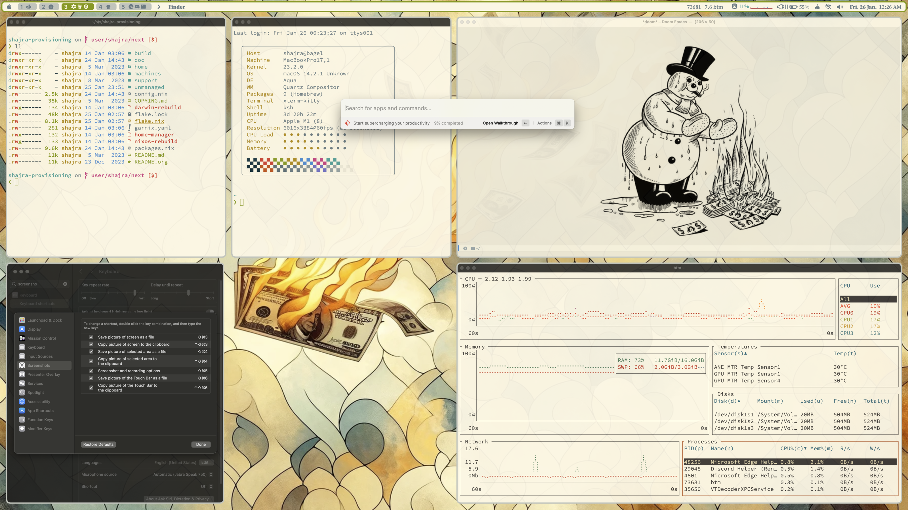

- [Computer setup with NixOS-style modules](#sec-1)
- [Some goals](#sec-2)
- [Applications used](#sec-3)
- [Keybindings](#sec-4)
- [Theming](#sec-5)
  - [Color Selection](#sec-5-1)
  - [Color and font configuration with Nix](#sec-5-2)
  - [Application cohesion](#sec-5-3)
- [Limitations of the UX](#sec-6)
- [Brew](#sec-7)
- [What sucks](#sec-8)

 

# Computer setup with NixOS-style modules

Configuring a computer can seem like a frivolous exercise, especially when it comes to terminal programs and window management. It's almost certainly not as much of a productivity boost as some might insinuate. But there's nothing wrong with feeling good about a tailored and functional environment with some aesthetic charm.

[NixOS's `nixos-rebuild`](https://nixos.org/manual/nixos/stable/index.html#sec-changing-config), [Nix-Darwin](https://daiderd.com/nix-darwin), and [Home Manager](https://github.com/nix-community/home-manager) provide a lot of NixOS-style modules that make it easy to enable a variety of programs and services. Home Manager even tells you when there are new configurations with `home-manager news` so that you can keep up with the latest available. Overall, it's easier to discover and try out new things.

Most of the time, I get what I need from upstream NixOS-style modules alone. Occasionally, I write some custom Nix code or make my own modules. Using modules this way works out pretty well because I get the front-end simplicity of NixOS-style modules, but enough programmatic control to avoid the limitations of configuration formats like YAML or TOML.

The rest of this document highlights some of the setup this project does. The document explains my rationale for personal preferences, admittedly slipping into advocacy for things I enjoy. I've just put in more hours than I care to admit into this, and I feel like sharing. And after over twenty years of setting up computers, this is a way to reflect on some choices.

# Some goals

Here are some constraints I tried to solve for:

-   Keybindings
    -   Vim-style
    -   Composable, making mnemonic sense
    -   Consistent across applications and window management (and even OS)
-   Application selection and configuration
    -   Modern mix of both expert- and beginner-friendly features
    -   Reasonable resource consumption (keep old machines out of landfills)
    -   Graphics are okay if they work better than text
-   Theming
    -   Consistent across applications and window management (and even OS)
    -   Legible fonts and color contrast
    -   Some aesthetic elegance
    -   Leaning into what's easy (avoid twisted hacks)
    -   Visually minimal without limiting ergonomics or function.

These constraints are all in addition to the larger goal of this project, which is to manage everything with Nix. Many fancy configurations exist but with a mess of supporting code. I'm somewhat satisfied with how everything turned out.

# Applications used

The following tables have some links to all the third-party tools that have been integrated by this project.

The first of these tables covers GUI tools that vary between Linux and Mac platforms:

| Purpose                | Linux                                                                                                                                            | Mac                                                                                                           |
|---------------------- |------------------------------------------------------------------------------------------------------------------------------------------------ |------------------------------------------------------------------------------------------------------------- |
| Terminal emulator      | [Kitty](https://sw.kovidgoyal.net/kitty/), [Alacritty](https://alacritty.org/), [rxvt-unicode](http://software.schmorp.de/pkg/rxvt-unicode.html) | [iTerm2](https://iterm2.com/), [Kitty](https://sw.kovidgoyal.net/kitty/), [Alacritty](https://alacritty.org/) |
| Window manager         | [i3](https://i3wm.org/)                                                                                                                          | [yabai](https://github.com/koekeishiya/yabai) + [JankyBorders](https://github.com/FelixKratz/JankyBorders)    |
| Hotkey manager         | [i3](https://i3wm.org/)                                                                                                                          | [skhd](https://github.com/koekeishiya/skhd)                                                                   |
| Status bar             | [i3status-rust](https://github.com/greshake/i3status-rust)                                                                                       | [SketchyBar](https://github.com/FelixKratz/SketchyBar) + [SbarLua](https://github.com/FelixKratz/SbarLua)     |
| GUI selection/launcher | [Rofi](https://github.com/davatorium/rofi)                                                                                                       | [Raycast](https://www.raycast.com/)                                                                           |
| GUI clipboard manager  | [Clipmenu](https://github.com/cdown/clipmenu) + [Rofi](https://github.com/davatorium/rofi)                                                       | [Raycast Clipboard History extension](https://www.raycast.com/extensions/clipboard-history)                   |
| GUI notification       | [Dunst](https://dunst-project.org/)                                                                                                              | MacOS-native notifications                                                                                    |
| GUI screenshots        | [Maim](https://github.com/naelstrof/maim)                                                                                                        | MacOS-native screenshots                                                                                      |
| Color temperature      | [Gammastep](https://gitlab.com/chinstrap/gammastep)                                                                                              | MacOS-native Night Shift                                                                                      |
| Package management     | [Nix](https://nixos.org/nix)                                                                                                                     | [Nix](https://nixos.org/nix) + [Homebrew](https://brew.sh/)                                                   |

Where I've listed multiple applications, my primary is listed first. Notably, for Macs, I'm using iTerm2, which does not configure easily with Nix. However, I use it because its native tmux integration with its `-CC` switch is too useful when working with remote machines.

The second table below covers tools common to the terminal experience in all platforms:

| Purpose                                       | Application                                                                                                                              |
|--------------------------------------------- |---------------------------------------------------------------------------------------------------------------------------------------- |
| Shell                                         | [Fish](https://fishshell.com/)                                                                                                           |
| Editors                                       | [Doom Emacs](https://github.com/hlissner/doom-emacs), [Visual Studio Code](https://code.visualstudio.com/), [Neovim](https://neovim.io/) |
| Shell prompt                                  | [Starship](https://starship.rs/)                                                                                                         |
| Smart directory jumping                       | [zoxide](https://github.com/ajeetdsouza/zoxide)                                                                                          |
| Fuzzy selection/launcher                      | [fzf](https://github.com/junegunn/fzf)                                                                                                   |
| Project/directory-level environment variables | [direnv](https://direnv.net/) + [Lorelei](https://github.com/shajra/direnv-nix-lorelei)                                                  |
| Man-page coloring                             | [colored\_man\_pages](https://github.com/PatrickF1/colored_man_pages.fish) Fish extension                                                |
| Terminal welcome message                      | [macchina](https://lib.rs/crates/macchina)                                                                                               |
| Syntax-highlighted Git diffs                  | [Delta](https://github.com/dandavison/delta)                                                                                             |
| Kitty history scrollback                      | [kitty-scrollback.nvim](https://github.com/mikesmithgh/kitty-scrollback.nvim)                                                            |

# Keybindings

I'm happy that a lot of my keybindings are consistent between Linux and Mac environments, so much so that I sometimes forget what platform I'm on.

Talking about keys between Macs and non-Mac keyboards can be annoying because there have been some historic divergences. A useful simplification, the USB HID tables, force these divergences to converge with modern USB-based keyboards:

| USB HID key | Non-Mac key | Mac key     |
|----------- |----------- |----------- |
| `GUI`       | `⊞ Windows` | `⌘ Command` |
| `Alt`       | `⎇ Alt`     | `⌥ Option`  |
| `Control`   | `^ Control` | `^ Control` |
| `Shift`     | `⇧ Shift`   | `⇧ Shift`   |

For each of these keys, we get both a left and right variant.

In general, I've come to expect the following conventions with my keybindings:

| USB HID key       | Side          | Purpose                     |
|----------------- |------------- |--------------------------- |
| `GUI`             | left          | custom window management    |
| `GUI`             | right         | standard MacOS bindings     |
| `Alt`             | left          | application shortcuts       |
| `Alt`             | right         | special character entry     |
| `Control`         | left or right | application shortcuts       |
| `Shift=+=Control` | `^ Control`   | terminal emulator shortcuts |

Having conventions like this helps with my recall of shortcuts as well as the fluidity of their usage. It's even nicer when it's consistent across operating systems.

In Linux, settling on the `Windows` (`GUI`) key for my shortcuts for `i3` window management is natural because no default shortcuts in Linux use the `Windows` key. On Macs, the corresponding `Command` key is used quite a bit for MacOS shortcuts. So I configure `skhd` to use only the right `Command` key for `yabai` window management.

By default, Macs use the `Option` key for special character input. Similarly, Linux is often configured such that the right `Alt` key is used to emulate the legacy [`Compose`](https://en.wikipedia.org/wiki/Compose_key) key or [`Alt Graph`](https://en.wikipedia.org/wiki/AltGr_key) key, for special characters. In Linux, this leaves the left `Alt` key for application shortcuts. In this spirit, some terminal emulators running in MacOS, such as iTerm2 and Kitty, can be configured to emit escaped codes with the right `Alt` key, the same as Linux.

Finally, terminal emulators are a little special because we don't want their shortcuts to override the terminal application running within them, which might have shortcuts of their own. By convention, many terminal emulators use `Shift=+=Control`, leaving other modifier combinations for applications.

# Theming

It can be nice when colors are consistent across different applications, though not all applications make it easy or possible. The pictures at the top of this document illustrate how I theme my Linux and Mac environments.

The Mac screenshot is a bit disingenuous. I don't use a wallpaper day-to-day because I find MacOS's transparency of unfocused windows distracting. I also don't have that wide a gap between windows. But it all makes for a nice screenshot.

## Color Selection

The color theme is [Solarized Light](https://ethanschoonover.com/solarized/). I like the thought put into considering the [CIELAB lightness](https://en.wikipedia.org/wiki/CIELAB_color_space) values when considering how readable various combinations of foreground and backgrounds would be.

There's been a long-standing trend towards dark color schemes. For me, this feels like a bit of an extreme. Dark color schemes make sense in low-light settings, but I'm most often in settings with reasonable daylight or enough room lighting. Gammastep's blue-light filtering is enough to alleviate eye strain without compromising Solarized contrast benefits.

This is not to say that I'm never in low-light settings, so there are some merits to switching to a dark color scheme. The following section discusses my approach to managing my theme with Nix, which can be augmented with a dark theme.

I feel like Solarized is misunderstood. If you regard Solarized as a retro color scheme, it can appear yellowed, like an old photograph. I think it's better to consider it more as a color scheme with natural tones. The yellow tone references a dawn or dusk sky tone. The green references greenery. Other colors reference tones found in bodies of water or floral accents. From this perspective, calling Solarized's light color scheme ugly feels like calling nature itself ugly.

Still, my adoption of Solarized Light is a bit jaded. I lean towards the gold and green hues. Combine that with the stolen snowman image, and I call it “Terminal Capitalism.”

## Color and font configuration with Nix

This project extends Nixpkgs with [a small overlay](../build/nixpkgs/overlays/lib/colors.nix) providing a way to specify a color palette (starting with Solarized). This overlay also provides some functions for manipulating colors and palettes.

The project then [provides a Home Manager module](../home/modules/ubiquity/theme/default.nix) that uses this extension of Nixpkgs to define a theme. Through module importing, other modules can then access the theme using the `config.theme` attribute.

I can use the color palette to describe colors with regular names like “yellow” and “red.” But the theme can map these colors to semantic concepts like “warning” and “critical.” This way, we can use the same colors consistently across all our applications.

In addition to colors, the theme also specifies a set of fonts. Using the same font across applications can help tie everything together along with the consistent color palette. I appreciate how the Source Serif family of variable-width fonts stylistically complement the Source Code family of monospaced fonts, so I've stuck with this pairing.

None of this is wildly exotic, but I think it's a nice illustration of using the expressiveness of Nix's expression language to manage configuration consistently across multiple applications.

There's no dark theme yet, but the infrastructure is all there to make and select it in the Home Manager theme module.

## Application cohesion

I was surprised by how many applications render as bordered boxes with possibly rounded corners. Set a background color, foreground color, and the radius for the corner, and different applications seem to be from the same product suite.

I'm also pleased by how my Macbook looks and feels like a Linux environment. Though having such a small user pool, Yabai and SketchyBar feel surprisingly stable, with active communities working through defects and features.

# Limitations of the UX

Tools like Doom Emacs have an approach to UX that I especially like. You can start with a key like the spacebar. And that gives you a menu of keys you can hit next. It's essentially a menu, but the path of the menu traversal becomes the efficient keybindings you memorize for the next time. Notably, the expert doesn't do something different from the beginner. The expert does what the beginner does, only faster.

It would be great if this convergence of the expert and beginner experience could be done beyond editors. I've worked so hard to have these keybindings for window management that have some elegance or are slightly intuitive. But beginners can't discover any of them easily. I have this problem because I'm not doing much more than just stringing together the same applications that everyone else is stringing together. This project is great for me and others with my specific taste for UX choices. I think other people could be included if there were more discovery.

# Brew

Ideally, we'd install and configure everything with Nix. Unfortunately, for a few programs, there's no Nix expression yet for MacOS. So we have to fall back to a package manager like [Homebrew](https://brew.sh/). This includes programs like Firefox and Chromium.

Though it's not ideal, Home Manager supports control over Homebrew. Assuming you've installed Homebrew already, this project will manage which packages/casks are installed, and remove any other packages/casks not specified.

At least we can get some automation, even if we don't get Nix's precision.

# What sucks

When looking for an application, there's sometimes an alternative from the [Suckless](https://suckless.org) community. I'm using the word “community” loosely to include both upstream authors and users, but not everyone completely. What I'm about to say is based on my experiences with the community in aggregate and the tendencies I've witnessed.

I have yet to use a Suckless program personally. There are a few reasons for this. The Suckless community obsesses over lines of code as a measure of complexity. This obsession is an implicit declaration of disbelief in the possibility of modular code. Modularity is only accepted between process boundaries, signaled by the rallying cry of "the Unix Way."

I firmly believe that modularity can exist at multiple levels. We shouldn't have system constraints that don't produce guaranteed system invariants that can be appreciated. If a programmer can't make a large program with good modularity, then good programmers don't exist. The Suckless philosophy is an implicit declaration that all programmers are bad. This is a cynical take the world shouldn't settle for. We should all try to do better.

In the case of Suckless programs, this misguided constraint of lines of code manifests in all configuration performed by patching source code. Diff files are notoriously anti-modular, and it's too easy for multiple patches to conflict upon application.

I have little doubt that Suckless programs are lean and fast. But in every case I find that other programs are just as fast or fast enough, with more features. And many of these programs do indeed manage complexity with modern approaches to modularity.

There's a tendency for members of the Suckless community to signal a political message that I find depressingly regressive. The Suckless community seems to relish a philosophy of “man up” or “read the fucking manual.” Even when feigning beginner-friendliness, they cling to grossly faulty arguments that programming *should* be this hard or obtuse. After 20-plus years of employment in this industry, I feel okay saying it should not be this hard. The last thing we need to do is convince beginners that they are not justified in believing that unnecessarily complex things are indeed unnecessary and complicated. It's tantamount to the cruelty of gaslighting.

Finally, the Suckless community intentionally continues to use words like “master” and “slave.” The onus is always on the offended not to take offense rather than the offender to make the simple courtesy of using a different word, which is of no significant cost.

This insensitivity continues with intentionally installing code of conduct files into projects with a singular and reductive sentence like "be good." We all can see that this isn't an object-level commentary. It's a meta-level commentary on the limitations of codes of conduct. If you genuinely feel that codes of conduct are limited, don't include one, or write more expressing the difficulty. Communicate with some empathy. To someone who faces the ills of cultural bias, just having some privileged man say "be good" is effectively the same as saying "tough shit."

There is a higher probability that members of disenfranchised groups will be beginners. They are, after all, disenfranchised. When we are hostile to beginners and communicate without empathy, we push the few people who pass the first gate back outside.

There are many reasons diversity in technology is lacking. Let's not make one more. That would suck the most.
